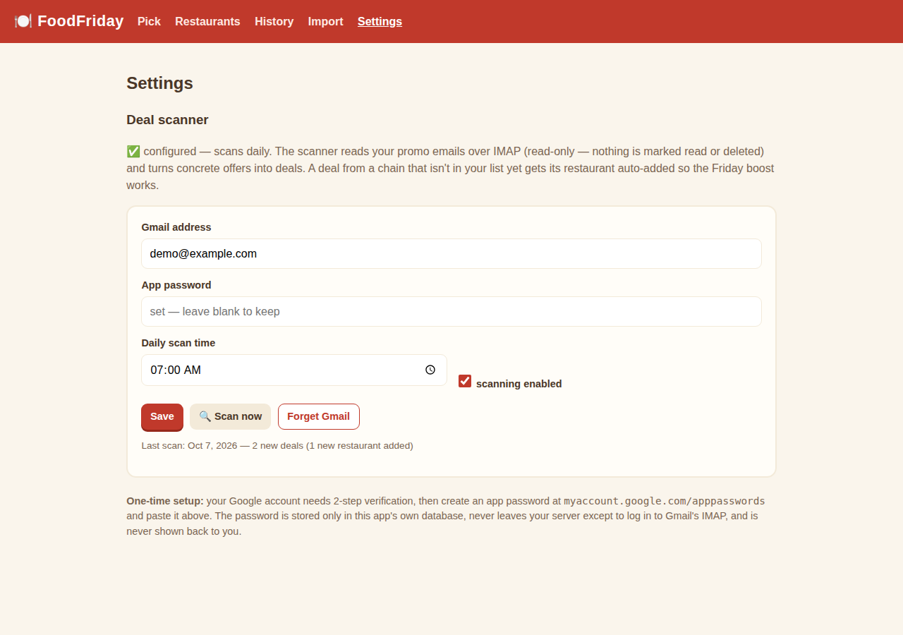

# 🍽️ FoodFriday

Friday dinner, decided. A tiny app for two people who keep asking each other "where do you want to eat?"

Hit **Pick 3 for us** and it deals three restaurants from your rotation — weighted toward places you haven't been in a while, with your favorites getting a boost. Tap the winner to log the visit, ✕ to veto a card and draw a replacement, or reroll all three.

**Working name** — like Fauna before it, "FoodFriday" is provisional. The name lives in `app/version.py` (`APP_NAME`), this README, and the compose service/container names.

## How the picker works

- **Weight** = days since your last visit (never-visited counts as 365), **×2** for ★ favorites.
- Places visited in the **last 7 days** are excluded — unless that would leave fewer than 3 candidates, in which case the rule relaxes.
- Only restaurants with **🎲 in picks** enabled are contenders — toggle it off per row (🚫 skipped) for spots that belong in your database but not on a Friday (kid-only drive-thrus, lunch-only joints, …).
- **Deals boost**: an *active* deal on a restaurant multiplies its weight by **×1.5**, and if the deal's item keywords match something you've actually ordered there (from receipt items), an extra **×1.25** on top. Pick cards show a 🏷️ badge with the deal title.
- Weighted random draw, no repeats within the three cards.
- Each card carries a one-line reason: *"New — never logged"*, *"Haven't been since Jun 2026"*, *"A favorite"*, …

## Pages

| Page | What it does |
|---|---|
| `/` | The picker: 3 cards, tap-to-log, veto, reroll |
| `/restaurants` | Your restaurant list — cuisine, price ($–$$$), notes, ★ favorites, visit counts, one-tap "We ate here tonight" |
| `/history` | Every logged visit (date, total, source), with delete |
| `/import` | Upload a seed JSON → preview → confirm. Re-imports are safe no-ops. |
| `/settings` | Gmail deal-scanner setup: address + app password, daily scan time, 🔍 Scan now, last-scan status |

## Import format

```json
{
  "restaurants": [
    {"name": "Taco Town", "cuisine": "Mexican", "price_tier": 1,
     "notes": "Great salsa bar", "favorite": true}
  ],
  "visits": [
    {"restaurant": "Taco Town", "visited_at": "2026-06-05",
     "total": 32.50, "source": "import", "external_id": "gmail:abc123",
     "items": ["Chicken Bowl", "Chips"]}
  ],
  "deals": [
    {"restaurant": "Taco Town", "title": "$1.49 Mozz Sticks today",
     "description": "App-only, today only", "valid_from": "2026-10-07",
     "valid_until": "2026-10-07", "item_keywords": ["mozz sticks"],
     "source": "email"}
  ]
}
```

Restaurants match by name (case-insensitive). Visits dedupe by `external_id` first, then by restaurant + date — re-importing the same seed also **backfills `items`** onto visits that don't have them yet. Deals dedupe by restaurant + title + valid_from, so re-imports are safe no-ops. A fake sample lives at `docs/sample-import.json` — try it on the Import page.

## Deals

Add them by hand on the `/restaurants` page (🏷️ Deals section at the bottom): title, optional dates, and comma-separated item keywords. Active ones appear first; expired ones are greyed out. A deal counts as active when today is between `valid_from` and `valid_until` — a blank `valid_until` means open-ended but only counts for 30 days from when it was added. Chain-wide deals (no restaurant picked) are stored for reference but don't affect the picker.

**Item-level bonus:** if a deal's item keywords substring-match anything in that restaurant's past receipt items (e.g. keyword `chip` matches an ordered `Chips`), the restaurant gets the extra ×1.25 multiplier.

### Automatic deal scanning (Gmail over IMAP)

The app scans your Gmail for promos itself — no manual imports. Open **/settings** and paste your Gmail address plus an app password; the scanner then runs every morning at your chosen time (default 7:00 AM) and turns concrete offers into deals. There's also a **🔍 Scan now** button on the Settings page.

**One-time setup:**
1. Your Google account needs 2-step verification turned on.
2. Go to `myaccount.google.com/apppasswords` → create an app password (name it "FoodFriday").
3. Paste the address + app password into Settings → Save.

The scan is **read-only**: it SELECTs your inbox and fetches with `BODY.PEEK[]`, so nothing is marked read, moved, or deleted. It looks at the last 14 days of emails from your chains' promo senders, keeps only concrete offers (skips brand fluff, merch, and expired promos), and extracts expiry the same way the manual script did — *"today only"* → that date, *"Valid thru 11/1/2026"* → parsed, unclear → 7 days out. Re-runs never create duplicates (dedupe on restaurant + title + valid-until).

If a deal arrives from a chain that **isn't in your restaurant list**, the restaurant is auto-added (marked "auto-added by the deal scanner", $ tier, included in Friday picks) so the weight boost works — toggle it off or delete it if it's not your kind of place.

**About the app password:** it's stored only in this app's own SQLite database, travels over TLS straight to Gmail's IMAP server, and is never shown back to you — the Settings page and API only ever report "set" or blank. There's a **Forget Gmail** button to wipe it entirely.

The old manual route still works if you ever want it: `scripts/scan_deals.py` turns promos into a deals seed you upload on the `/import` page — but with the scanner running, you'll never need to.

### Parsing receipt items

`scripts/parse_receipt_items.py` reads the receipt markdowns saved under `~/workspace/email/gmail/` (no Gmail re-read) and matches them to seed visits by chain + date:

```bash
PYTHONPATH=. .venv/bin/python scripts/parse_receipt_items.py --write  # update seed/real-history.seed.json
```

Known-good formats: Chipotle, Sonic, Spangles, Casey's. After updating the seed, re-import it — duplicate visits get their `items` backfilled. These items are what the deal item-keyword bonus matches against.

**Privacy note:** your real history (email-receipt backfills and the like) should live in a local file like `seed/*.seed.json` — that directory is gitignored and never committed, and the Docker image ships with an empty database. Upload your real data through the Import page after deploying.

## Run it (Docker / Dockge)

```yaml
services:
  foodfriday:
    image: ghcr.io/elyld/foodfriday:latest
    container_name: foodfriday-dinner-decider
    restart: unless-stopped
    ports:
      - "${FOODFRIDAY_PORT:-4002}:8000"
    environment:
      FOODFRIDAY_DATA_DIR: /data
FOODFRIDAY_DATABASE_URL: sqlite:////data/foodfriday.db
    volumes:
      - ./data:/data
```

Or paste-ready: the repo's `docker-compose.yml` is a drop-in Dockge stack. Then open `http://localhost:4002`.

## Local dev

```bash
python3 -m venv .venv && .venv/bin/pip install -r requirements.txt
PYTHONPATH=. .venv/bin/python -m uvicorn app.main:app --port 4002
PYTHONPATH=. .venv/bin/python -m pytest -q   # 70 tests
```

## Screenshots

| | |
|---|---|
|  |  |
|  |  |
|  | |

## Stack

FastAPI + SQLite (WAL) + Docker, port 4002. Images publish to GHCR on every `main` push (`:latest`) and on `v*` tags. Single-user, no auth — it runs on your own server.
