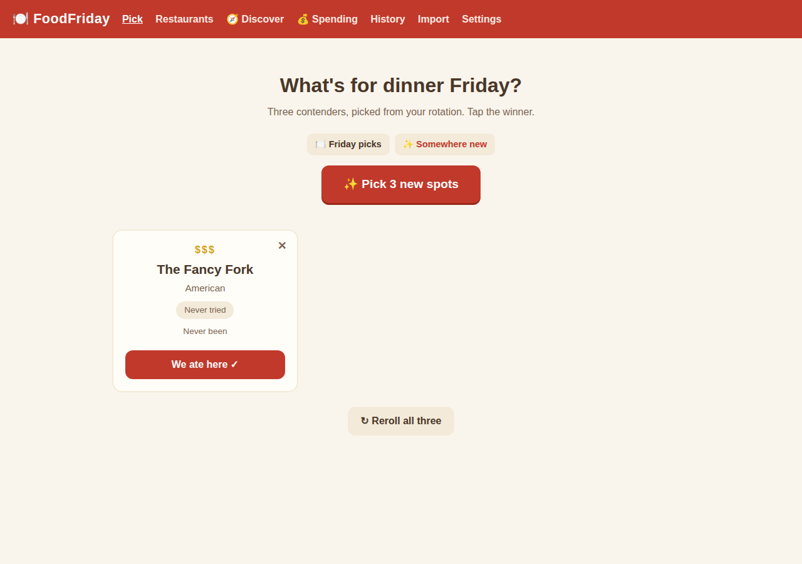
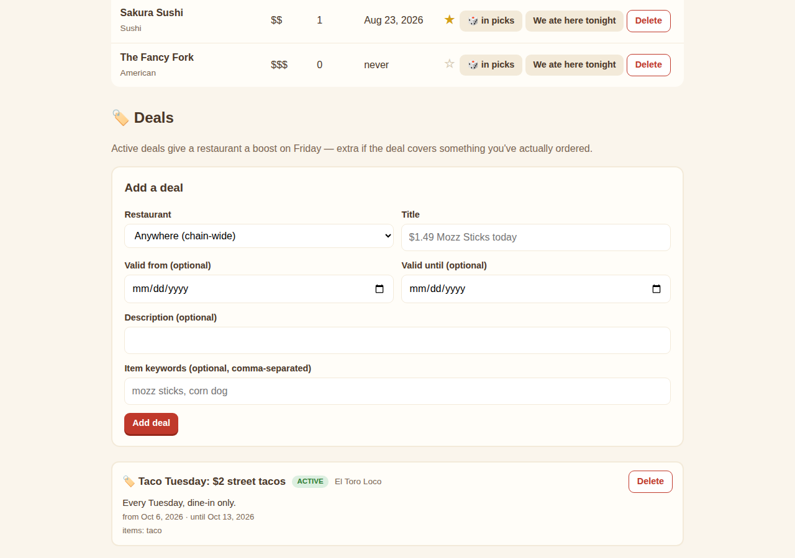
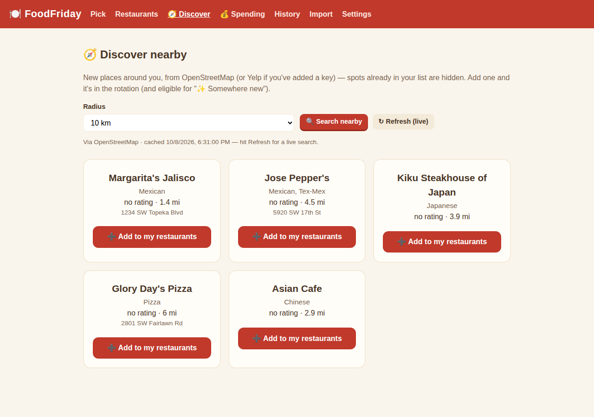
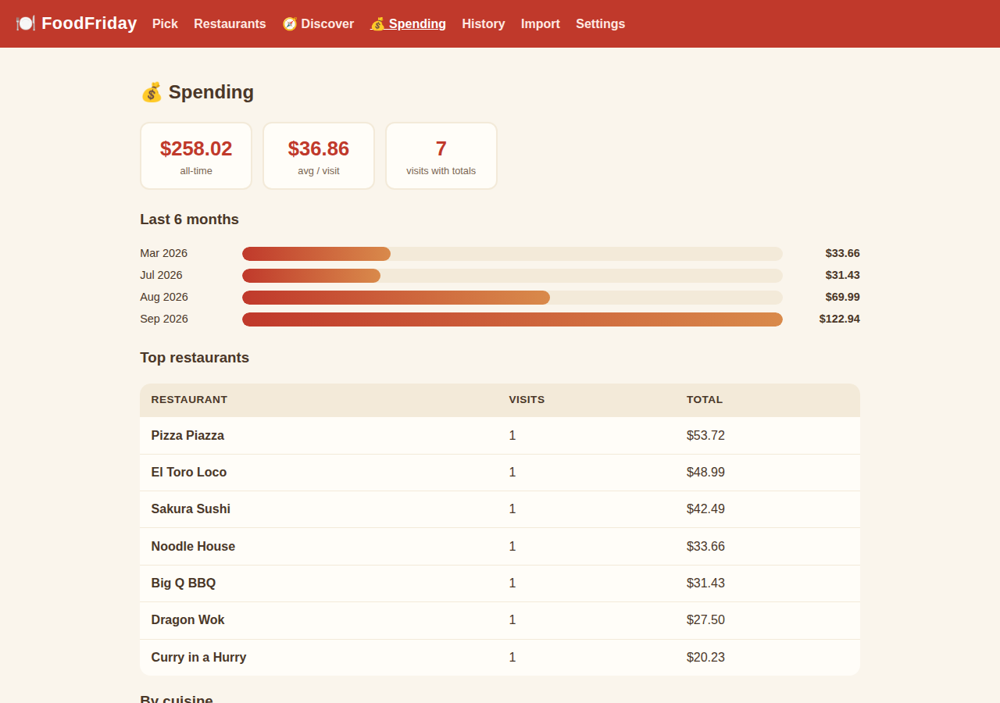
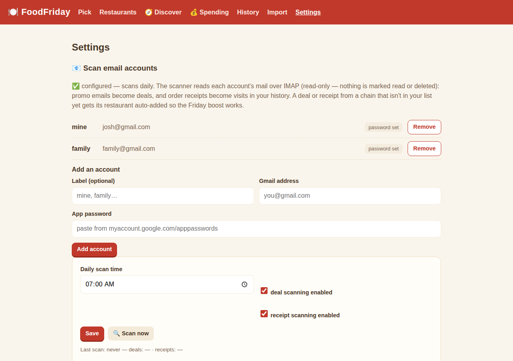
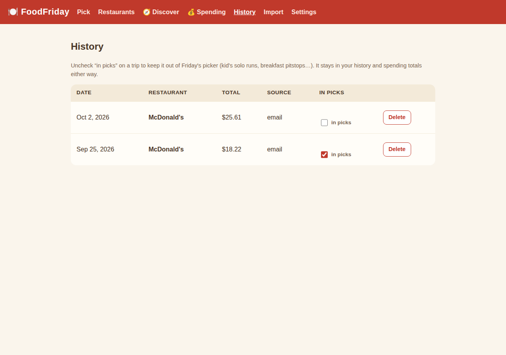

# 🍽️ FoodFriday

Friday dinner, decided. A tiny app for two people who keep asking each other "where do you want to eat?"

Hit **Pick 3 for us** and it deals three restaurants from your rotation — weighted toward places you haven't been in a while, with your favorites getting a boost. Tap the winner to log the visit, ✕ to veto a card and draw a replacement, or reroll all three.

**Working name** — like Fauna before it, "FoodFriday" is provisional. The name lives in `app/version.py` (`APP_NAME`), this README, and the compose service/container names.

## How the picker works

- **Weight** = days since your last visit (never-visited counts as 365), **×2** for ★ favorites.
- Places visited in the **last 7 days** are excluded — unless that would leave fewer than 3 candidates, in which case the rule relaxes.
- Only restaurants with **🎲 in picks** enabled are contenders — toggle it off per row (🚫 skipped) for spots that belong in your database but not on a Friday (kid-only drive-thrus, lunch-only joints, …).
- **Deals boost**: an *active* deal on a restaurant multiplies its weight by **×1.5**, and if the deal's item keywords match something you've actually ordered there (from receipt items), an extra **×1.25** on top. Pick cards show a 🏷️ badge with the deal title.
- Weighted random draw, no repeats within the three cards.
- Each card carries a one-line reason: *"New — never logged"*, *"Haven't been since Jun 2026"*, *"A favorite"*, …
- **✨ Somewhere new mode**: flip the toggle on the home page and the picker draws only from restaurants with zero logged visits — same 3-card UI, tap-to-log, reroll, veto. A stored Yelp rating gives a gentle tiebreak boost. Empty state points you at Discover.
- **Cuisine rotation**: by default the picker skips the cuisine of your most recent visit (*"skipping Mexican — last week's pick"*), with an "include it anyway" override. Toggle it in Settings → Picker.
- **Per-trip opt-out**: on the `/history` page every visit has an **"in picks"** checkbox. Uncheck a trip (kid's solo McDonald's run, breakfast pitstop, …) and the picker pretends it never happened for weighting, the 7-day rule, cuisine rotation, deal item matching, and "last visit" lines — a restaurant with *all* trips unchecked is treated as never-visited. The trip stays in History and **still counts in Spending** (money spent is money spent).

## Pages

| Page | What it does |
|---|---|
| `/` | The picker: 3 cards, tap-to-log, veto, reroll, Friday / Somewhere-new modes |
| `/restaurants` | Your restaurant list — cuisine, price ($–$$$), notes, ★ favorites, visit counts, one-tap "We ate here tonight" |
| `/discover` | 🧭 Nearby restaurants via OpenStreetMap (distance, cuisine) — one-tap add to your list |
| `/spending` | 💰 Spending dashboard: all-time + average, last 6 months, top restaurants, by cuisine |
| `/history` | Every logged visit (date, total, source), with delete + per-trip "in picks" checkbox |
| `/import` | Upload a seed JSON → preview → confirm. Re-imports are safe no-ops. |
| `/settings` | Email accounts for the deal/receipt scanner, Discover location (+ optional Yelp key), Discord Friday nudge, picker options |

## Import format

```json
{
  "restaurants": [
    {"name": "Taco Town", "cuisine": "Mexican", "price_tier": 1,
     "notes": "Great salsa bar", "favorite": true}
  ],
  "visits": [
    {"restaurant": "Taco Town", "visited_at": "2026-06-05",
     "total": 32.50, "source": "import", "external_id": "gmail:abc123",
     "items": ["Chicken Bowl", "Chips"]}
  ],
  "deals": [
    {"restaurant": "Taco Town", "title": "$1.49 Mozz Sticks today",
     "description": "App-only, today only", "valid_from": "2026-10-07",
     "valid_until": "2026-10-07", "item_keywords": ["mozz sticks"],
     "source": "email"}
  ]
}
```

Restaurants match by name (case-insensitive). Visits dedupe by `external_id` first, then by restaurant + date — re-importing the same seed also **backfills `items`** onto visits that don't have them yet. Deals dedupe by restaurant + title + valid_from, so re-imports are safe no-ops. A fake sample lives at `docs/sample-import.json` — try it on the Import page.

## Deals

Add them by hand on the `/restaurants` page (🏷️ Deals section at the bottom): title, optional dates, and comma-separated item keywords. Active ones appear first; expired ones are greyed out. A deal counts as active when today is between `valid_from` and `valid_until` — a blank `valid_until` means open-ended but only counts for 30 days from when it was added. Chain-wide deals (no restaurant picked) are stored for reference but don't affect the picker.

**Item-level bonus:** if a deal's item keywords substring-match anything in that restaurant's past receipt items (e.g. keyword `chip` matches an ordered `Chips`), the restaurant gets the extra ×1.25 multiplier.

### Automatic deal + receipt scanning (Gmail over IMAP)

The app scans your Gmail itself — no manual imports. Open **/settings** and add each Gmail account you want scanned (label optional, address, app password); the scanner then runs every morning at your chosen time (default 7:00 AM) in **two phases**: promos become deals, and order receipts become visits in your history. There's also a **🔍 Scan now** button on the Settings page. Each phase has its own enable toggle and its own result line ("deals: … · receipts: …").

**Scans run in the background:** hitting Scan now returns instantly and the scan works through your mail behind the scenes — a first run over ~30 senders × 14 days of mail normally takes **1–3 minutes**. The Settings page shows a "🔄 Scan running…" notice while it's going, and the result lines appear when it lands. If the button seems to do nothing, give it a couple of minutes and refresh. Overlapping scans are blocked: a second Scan now (or the daily job firing mid-scan) just stands down.

**One-time setup per account:**
1. That Google account needs 2-step verification turned on.
2. Go to `myaccount.google.com/apppasswords` → create an app password (name it "FoodFriday").
3. Settings → Add an account → paste the address + app password → Add account.

Each account gets its own IMAP session; if one account's password goes stale, its failure is recorded in the result line and the other accounts still scan. Upgrading from the old single-account setup is automatic — the old address/password move into the accounts list as "primary" on first startup.

The scan is **read-only**: it SELECTs your inbox and fetches with `BODY.PEEK[]`, so nothing is marked read, moved, or deleted. Deals: it looks at the last 14 days of emails from your chains' promo senders, keeps only concrete offers (skips brand fluff, merch, and expired promos), and extracts expiry the same way the manual script did — *"today only"* → that date, *"Valid thru 11/1/2026"* → parsed, unclear → 7 days out. Re-runs never create duplicates (dedupe on restaurant + title + valid-until).

**Receipts:** order confirmations are matched by sender + subject against 20 known patterns (Chipotle, Taco Bell, Domino's, Casey's, Sonic, Spangles, Chili's, Panera, Buffalo Wild Wings, Whataburger, Little Caesars, Arby's, KFC, Wendy's, Dairy Queen, Raising Cane's, Pizza Hut, DoorDash, Uber Eats, Grubhub). Totals are parsed per-chain; a confirmation with no parseable total is still logged with a blank total so recency weighting sees it. Receipts from a chain **not in your list** auto-add the restaurant ("auto-added by the receipt scanner"). Re-runs never duplicate (dedupe on `gmail:<message-id>`).

**Skip list:** every restaurant row has a 🧾 tracking toggle. Flip it to 📵 and the receipt scanner skips that place entirely — no visits, no auto-anything. (If you ever re-add McDonald's for the kid's Friday runs, this is the switch.)

**About the app passwords:** each is stored only in this app's own SQLite database, travels over TLS straight to Gmail's IMAP server, and is never shown back to you — the Settings page and API only ever report "set" or blank. Remove an account any time with its **Remove** button.

The old manual route still works if you ever want it: `scripts/scan_deals.py` turns promos into a deals seed you upload on the `/import` page — but with the scanner running, you'll never need to.

### Parsing receipt items

`scripts/parse_receipt_items.py` reads the receipt markdowns saved under `~/workspace/email/gmail/` (no Gmail re-read) and matches them to seed visits by chain + date:

```bash
PYTHONPATH=. .venv/bin/python scripts/parse_receipt_items.py --write  # update seed/real-history.seed.json
```

Known-good formats: Chipotle, Sonic, Spangles, Casey's. After updating the seed, re-import it — duplicate visits get their `items` backfilled. These items are what the deal item-keyword bonus matches against.

**Privacy note:** your real history (email-receipt backfills and the like) should live in a local file like `seed/*.seed.json` — that directory is gitignored and never committed, and the Docker image ships with an empty database. Upload your real data through the Import page after deploying.

## 🧭 Discover (nearby restaurants via OpenStreetMap)

The Discover tab finds restaurants around you that aren't in your list yet — with distance, cuisine, and address. Spots already in your database are hidden automatically. **➕ Add to my restaurants** drops one into the rotation (eligible for ✨ Somewhere new mode).

**Setup** (Settings → Discover): set your home location (type it or hit **📍 Use my location**) and Save — that's it, no key or signup. Search runs on OpenStreetMap/Overpass.

Why not Yelp? Yelp retired free self-serve app creation (the create button is greyed out and their docs now push paid plans), so OpenStreetMap is the default provider. If you ever get a Yelp Fusion API key, pasting it in Settings switches Discover to Yelp (adds star ratings); the key is stored only in this app's own database and never shown back to you. Results are **cached for 24 hours** per provider + location + radius — the page shows which provider served the results and a Refresh link for a live search.

## 🔔 Friday nudge (Discord)

Every Friday morning FoodFriday can post the 3 picks to your Discord — names, cuisine, the reason line, and any 🏷️ deal. Setup:

1. In your Discord server: channel settings → Integrations → Webhooks → New Webhook → Copy URL.
2. Settings → paste the webhook URL, set the Friday time (default 10:00 AM), enable, Save.
3. Hit **📣 Send test** to verify it lands.

Failures are recorded on the Settings page (last-nudge line) and never break anything else. Scheduler times are container-local — keep `TZ: America/Chicago` in your Dockge stack or the nudge fires at the wrong hour (same UTC trap as the deal scanner).

## 💰 Spending

The Spending tab totals your logged visits: all-time spend, average per visit, a 6-month bar chart, top-10 restaurants, and spend by cuisine. Visits without a total are excluded from the math and counted separately (*"N visit(s) without a total were excluded"*).

## Run it (Docker / Dockge)

```yaml
services:
  foodfriday:
    image: ghcr.io/elyld/foodfriday:latest
    container_name: foodfriday-dinner-decider
    restart: unless-stopped
    ports:
      - "${FOODFRIDAY_PORT:-4002}:8000"
    environment:
      FOODFRIDAY_DATA_DIR: /data
FOODFRIDAY_DATABASE_URL: sqlite:////data/foodfriday.db
    volumes:
      - ./data:/data
```

Or paste-ready: the repo's `docker-compose.yml` is a drop-in Dockge stack. Then open `http://localhost:4002`.

## Local dev

```bash
python3 -m venv .venv && .venv/bin/pip install -r requirements.txt
PYTHONPATH=. .venv/bin/python -m uvicorn app.main:app --port 4002
PYTHONPATH=. .venv/bin/python -m pytest -q   # 105 tests
```

## Screenshots

| | |
|---|---|
|  |  |
|  |  |
|  |  |
|  |  |
|  | |

## Stack

FastAPI + SQLite (WAL) + Docker, port 4002. Images publish to GHCR on every `main` push (`:latest`) and on `v*` tags. Single-user, no auth — it runs on your own server.
