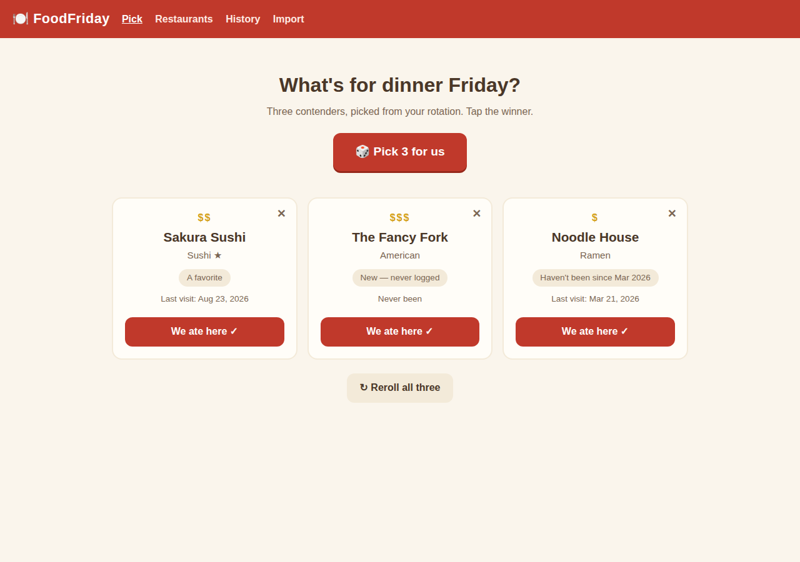
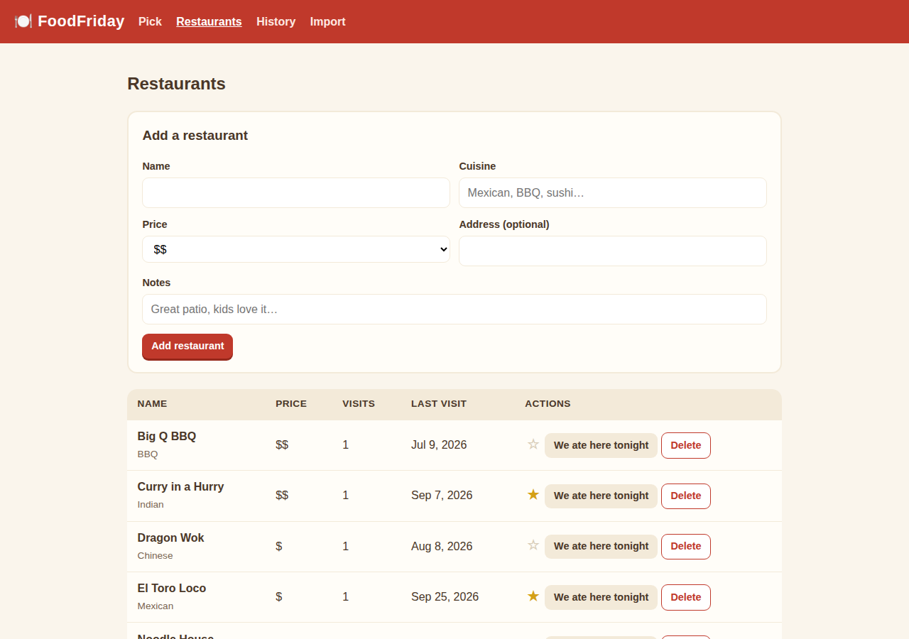
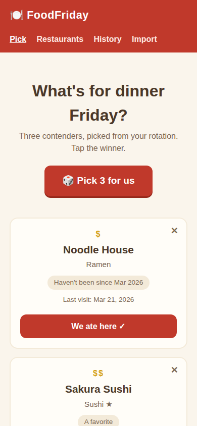

# 🍽️ FoodFriday

Friday dinner, decided. A tiny app for two people who keep asking each other "where do you want to eat?"

Hit **Pick 3 for us** and it deals three restaurants from your rotation — weighted toward places you haven't been in a while, with your favorites getting a boost. Tap the winner to log the visit, ✕ to veto a card and draw a replacement, or reroll all three.

**Working name** — like Fauna before it, "FoodFriday" is provisional. The name lives in `app/version.py` (`APP_NAME`), this README, and the compose service/container names.

## How the picker works

- **Weight** = days since your last visit (never-visited counts as 365), **×2** for ★ favorites.
- Places visited in the **last 7 days** are excluded — unless that would leave fewer than 3 candidates, in which case the rule relaxes.
- Weighted random draw, no repeats within the three cards.
- Each card carries a one-line reason: *"New — never logged"*, *"Haven't been since Jun 2026"*, *"A favorite"*, …

## Pages

| Page | What it does |
|---|---|
| `/` | The picker: 3 cards, tap-to-log, veto, reroll |
| `/restaurants` | Your restaurant list — cuisine, price ($–$$$), notes, ★ favorites, visit counts, one-tap "We ate here tonight" |
| `/history` | Every logged visit (date, total, source), with delete |
| `/import` | Upload a seed JSON → preview → confirm. Re-imports are safe no-ops. |

## Import format

```json
{
  "restaurants": [
    {"name": "Taco Town", "cuisine": "Mexican", "price_tier": 1,
     "notes": "Great salsa bar", "favorite": true}
  ],
  "visits": [
    {"restaurant": "Taco Town", "visited_at": "2026-06-05",
     "total": 32.50, "source": "import", "external_id": "gmail:abc123"}
  ]
}
```

Restaurants match by name (case-insensitive). Visits dedupe by `external_id` first, then by restaurant + date. A fake sample lives at `docs/sample-import.json` — try it on the Import page.

**Privacy note:** your real history (email-receipt backfills and the like) should live in a local file like `seed/*.seed.json` — that directory is gitignored and never committed, and the Docker image ships with an empty database. Upload your real data through the Import page after deploying.

## Run it (Docker / Dockge)

```yaml
services:
  foodfriday:
    image: ghcr.io/elyld/foodfriday:latest
    container_name: foodfriday-dinner-decider
    restart: unless-stopped
    ports:
      - "${FOODFRIDAY_PORT:-4002}:8000"
    environment:
      FOODFRIDAY_DATA_DIR: /data
FOODFRIDAY_DATABASE_URL: <redacted>
    volumes:
      - ./data:/data
```

Or paste-ready: the repo's `docker-compose.yml` is a drop-in Dockge stack. Then open `http://localhost:4002`.

## Local dev

```bash
python3 -m venv .venv && .venv/bin/pip install -r requirements.txt
PYTHONPATH=. .venv/bin/python -m uvicorn app.main:app --port 4002
PYTHONPATH=. .venv/bin/python -m pytest -q   # 27 tests
```

## Screenshots

| | |
|---|---|
|  |  |
|  | |

## Stack

FastAPI + SQLite (WAL) + Docker, port 4002. Images publish to GHCR on every `main` push (`:latest`) and on `v*` tags. Single-user, no auth — it runs on your own server.
